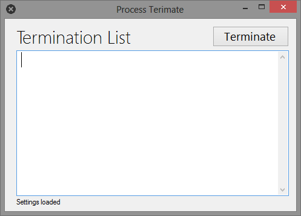
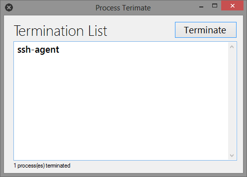

**ProcessKill** is a windows app that enable you to quickly end multiple
unused/unnessary processes. Write down the processes to be ended for the first
time only. Then, each time you open the application, the process terminate list
is loaded. Press `Kill` to end all of them. 
 
 

 
Start **ProcessKill**. Previously set termination list is loaded.
 
 

 
`ssh-agent` is the process that is desired to be killed.
 
 

 
List to processes to be terminated are to be written here, each on a separate line.
 
 

 
The process is killed.
 
 
